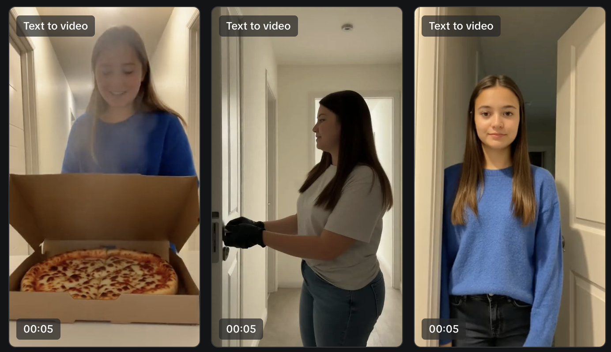
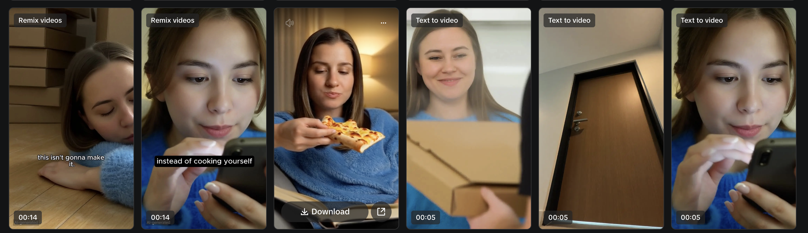

# Symphony Orchestrator — A 5s → 30s Ad Workflow for TikTok Symphony

**One-liner:** I shipped a working LLM middleware that fixes the most painful friction in TikTok's Symphony Creative Studio — the 5-second video generation limit and the prompt-engineering learning curve — by orchestrating raw advertiser ideas into a sequence of consistency-locked, model-ready prompts.

**Stack:** Python · Gemini API · Streamlit · built end-to-end in Cursor over a few evenings.
**Repo:** [`tiktok-aigc-pm-project`](https://github.com/swa311096/tiktok-aigc-pm-project) · **Live entry:** `app.py` (Streamlit) · **Core logic:** [`scripts/symphony_orchestrator.py`](scripts/symphony_orchestrator.py)

---

## The problem I noticed

I started this as a PM teardown of TikTok Symphony. Three friction points kept showing up in every test session:

1. **5-second cap.** Symphony's text-to-video model (Seedance 1.5) only outputs 5-second clips. A normal 30s ad means the user has to manually break their idea into 6 sequential prompts.
2. **Prompt education gap.** ByteDance's official prompt guide is excellent but assumes the user will read it. SMB advertisers won't.
3. **No memory between clips.** Generative video has zero state across runs, so the same character renders as 6 different people across the 6 clips.

The underlying model is world-class. The friction is entirely in the workflow layer — which is exactly the kind of thing a thin LLM wrapper can fix.

## What I built

A Python orchestrator that takes one messy advertiser brief and returns a JSON sequence of Symphony-ready prompts, each guaranteed to obey the 7 constraints I distilled from ByteDance's prompt guide.

**Input** (real advertiser-style brain dump):

> "I need a 30-second ad for a food delivery app called QuickBite. A tired woman in a blue sweater sitting on the floor surrounded by moving boxes. She picks up her phone, opens the app, doorbell rings, opens door to a hot pizza, ends with her happily eating on the couch."

**Output** (one of six segments, automatically generated):

```text
[Clip 2 | 5s–10s]
An over-the-shoulder shot behind the young woman who looks exactly like
Emma Watson wearing a blue fluffy sweater, as she lifts a smartphone from
the floor. The screen displays a colorful food ordering interface icon,
not text.
```

These plug **directly** into Symphony's text-to-video tool, are stitched in Symphony's native Remix tool, and produce a coherent 30s ad. The full output video is checked in at `assets/final-output.mp4`.

## The hard part: forcing consistency across stateless clips

The interesting engineering wasn't the LLM call — it was discovering and codifying the rules through iteration. I ran the orchestrator end-to-end through Symphony three times, watched what broke, and added a rule each round.

| Iteration | What I added | What it fixed | What still broke |
|-----------|--------------|---------------|------------------|
| **v1** — Base rules | No conversational language, no text-in-video, single scene per prompt, visuals only | Prompts now compile cleanly | Same character rendered as 6 different people |
| **v2** — Celebrity lock | "A young woman who looks exactly like Emma Watson..." injected into every prompt | Faces now consistent | Clothing drifted clip-to-clip; backgrounds morphed |
| **v3** — Clothing lock + shot variety | Forced a fixed outfit description into every prompt; required different camera angles per clip to mask AI prop morphing | Final output is coherent enough to ship | — |




The "celebrity-lookalike + clothing lock + camera-angle variety" trio is the non-obvious insight. It uses what the model is good at (rendering recognizable people, varied compositions) to paper over what it's bad at (memory, prop continuity).

## How I actually used AI coding tools

This is the part the application is asking about, so being specific:

- **Cursor as the primary build environment.** The whole project — Python orchestrator, Streamlit UI, `prompts.json` schema, three iterations of the rule set, the writeup articles — was written in Cursor. I leaned on agent mode for the Streamlit scaffolding (`app.py`) and the model-selection fallback logic in the orchestrator (auto-detects the latest available Gemini Flash model so the script doesn't break when older versions deprecate).
- **AI as the product itself.** Gemini Flash sits at the core: it's the orchestration brain that does the breakdown. The system prompt in [`scripts/symphony_orchestrator.py`](scripts/symphony_orchestrator.py) is the actual product — I rewrote it three times based on observed Symphony output failures.
- **Tight feedback loop.** Generate prompts → paste into Symphony → watch what breaks visually → ask the agent to add a constraint to the system prompt → regenerate. The screenshots above are the literal artifacts of that loop.
- **Demo mode for the Streamlit app.** I had Cursor add a no-API-key demo path so the app is presentable without burning credits — important for a portfolio piece anyone can clone and run.

## What you can actually run in 60 seconds

```bash
git clone https://github.com/swa311096/tiktok-aigc-pm-project
cd tiktok-aigc-pm-project
pip install streamlit google-generativeai python-dotenv
streamlit run app.py
```

Toggle "Demo Mode" on in the sidebar — no API key needed — and you'll see the orchestrator break a brief into 5-second segments live.

## Why I think this matters

The PM lesson here: when a generative model is already world-class (Seedance is genuinely competitive with Sora on action sequencing), the highest-leverage product work isn't model improvement — it's the **orchestration layer between messy human intent and the model's ideal input shape**. An LLM middleware that hides the 5-second limit and bakes in the consistency tricks would, if integrated natively, take a 20-minute storyboarding-and-prompting workflow down to one input box. That's the kind of unlock that grows the entire SMB advertiser surface, which is what makes Symphony interesting as a business in the first place.

---

**Further reading in this repo:**
- [Deep dive: Symphony Creative Studio teardown](portfolio_articles/article_02_symphony_creative_studio_generation.md) — the full PM analysis that surfaced the problem
- [The Orchestrator solution writeup](portfolio_articles/article_03_symphony_orchestrator_solution.md) — long-form version of the iteration story above
